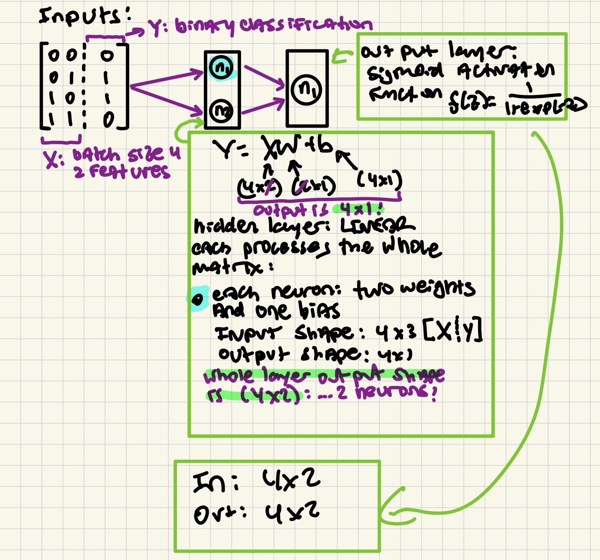
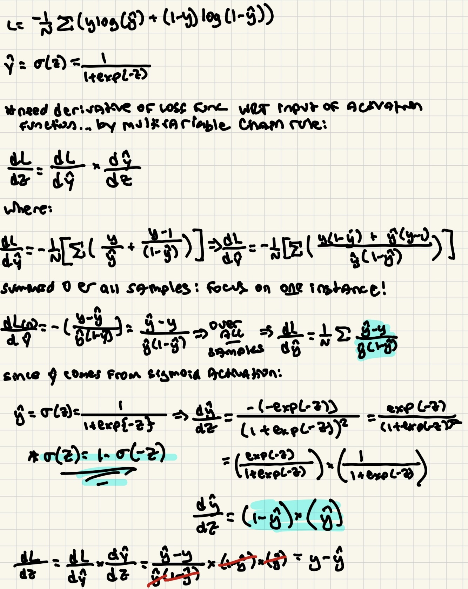
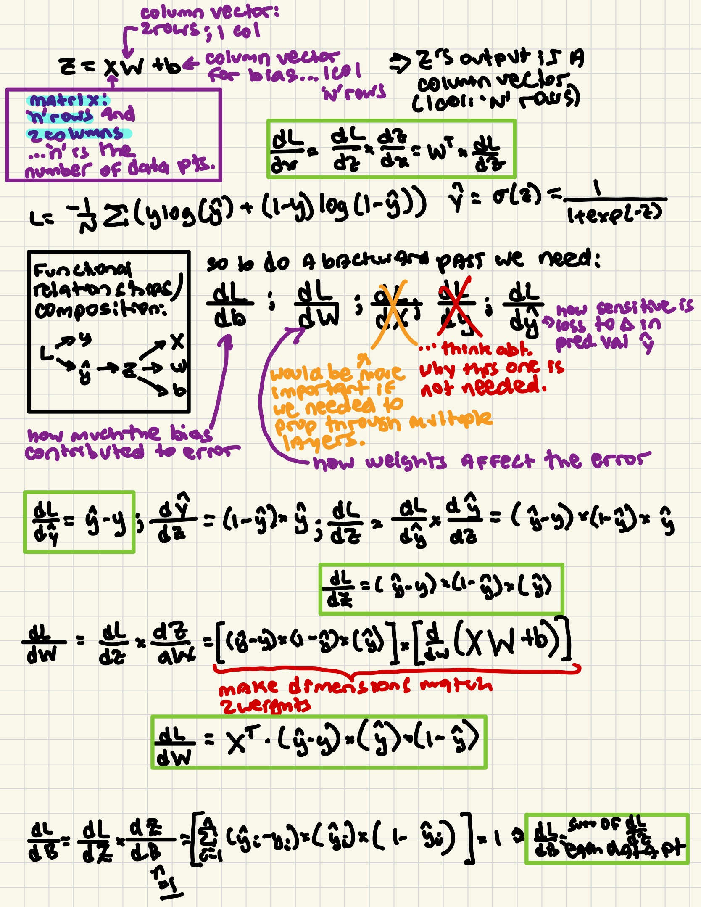

# Learning XOR using a simple neural network:

A variation of an example from "Deep Learning : Goodfellow / Bengio / Courville" Chapter 6.  A basic diagram of the simple network structure:

### Activation function:

Using the sigmoid activation function:

$$
\sigma(Z)=\frac{1}{1 + \exp (-Z) }
$$

which comes from `scipy.special` as `expit`

### Loss function

Since this is a  binary classification problem with a sigmoid activation function, the loss function of choice is the *binary cross-entropy loss*

$$
L = \frac{-1}{N}\sum \big( y\log(\hat{y}) + (1-y)\log(1-\hat{y})   )
$$

Where $N$ is the batch size, $y$ is the true output of the traning sample and $\hat{y}$ is the output predicted by the neural network.  Below, these are `y_true` and `y_pred` respectively.

We need the derivative of the loss function with respect to the input to the activation function.  This comes from the multivariable chain rule:

$$
\frac{\partial L }{\partial Z} = \big(\frac{\partial L}{\partial \hat{y}}\big)\times\big(\frac{d\hat{y}}{dz}\big) = 
\big(\frac{\exp(-Z)}{1 + \exp(-Z)}\big)\times\big(\frac{1}{1 + \exp(-Z)}\big) = (1-\hat{y})\times \hat{y}
$$

The work for this is shown below:

More work on some of the derivatives and connecting them with model structure:

